# Project-16: Java App Deployment on Kubernetes Cluster

[*Project Source*](https://www.udemy.com/course/decodingdevops/learn/lecture/26466532#overview)

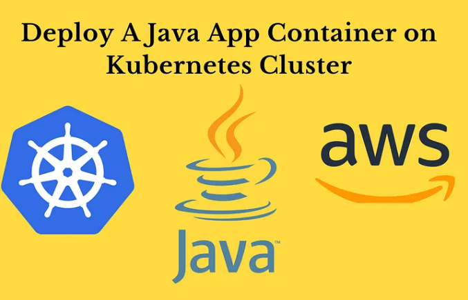

## Prerequisites
* AWS account
* Registered DNS name

## Step-1: Create an EC2 instance

- Launch an Ec2 instance to install kops with below properties.
```sh 
Name: kops
AMI: Ubuntu 22.04
InstanceType: t2.micro
SecGrp: allow SSH on port 22 from MyIP
KeyPair: kops-key
```

## Step-2: Create S3 bucket

- Create an S3 bucket with details below to store the state of Kops so we can run our Kops command from anywhere as long as it is pointed to our s3 bucket.
```sh
Bucketname: Vprofile-kops-state25
```
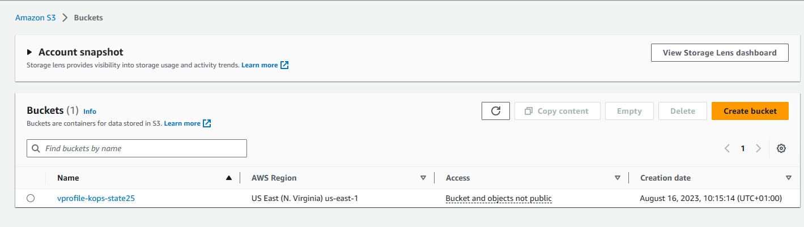

## Step-3: Create IAM user

Create an IAM user for our awscli with details below:
```sh
Username: Kops-admin
Attach policies: Adminstrator Access
Be sure to download the credentials.
```

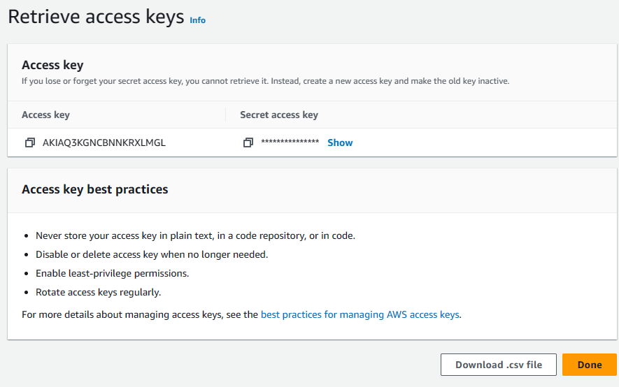

## Step-4: Create Route53 Hosted Zone

Create Hosted Zone in Route53 with details below
```sh
Domain Name: kubevpro.<yourdomain-name.com>
```
- Then create 4 NS values to our Registered domain as `NS Record`.
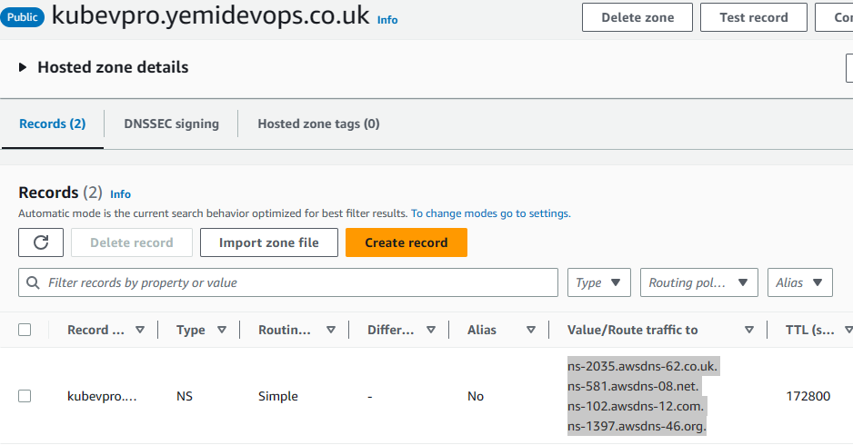

## Step-5: Login Ec2 and configure awscli

- Now that we have our IAM user, S3 bucket and Domain setup, we can login and configure our ec2 instance.
* Log in to your ec2 instance and generate ssh-key which would be used by our Kops.
* Install and configure aws cli with commands below
```sh
sudo apt update && sudo apt install awscli -y
aws configure
then add the aws access key and secret key you already created and downloaded alongside your ec2 instance region.
Output "Json"
```

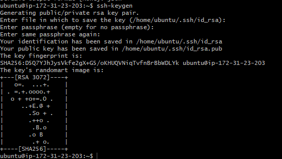

## Step-6: Setup kops Cluster

- Next, Install and setup Kubectl with commands from the documentation link here https://kubernetes.io/docs/tasks/tools/install-kubectl-linux/
```sh
curl -LO "https://dl.k8s.io/release/$(curl -L -s https://dl.k8s.io/release/stable.txt)/bin/linux/amd64/kubectl"
chmod +x ./kubectl
sudo mv kubectl /usr/local/bin/
```
- Next, install Kubernetes with Kops with documentation link here https://github.com/kubernetes/kops/releases . Navigate to `v1.25.4` > `Assets` > `kops-linux-amd64`, then right click to copy the link.
```sh
wget https://github.com/kubernetes/kops/releases/download/v1.25.4/kops-linux-amd64
ls
chmod +x kops-linux-amd64
sudo mv kops-linux-amd64 /usr/local/bin/kops
```

-Verify Domain with the command below
```sh
nslookup -type=ns kubevpro.<yourdomain-name.com>
```


- Now we are going to run Kops command to create our Kubernetes cluster with details below:
- Note: Don't forget to replace your domain name and s3 bucket name in the command.
```sh
kops create cluster --name=kubeapp.<your domain> \
--state=s3://<bucket name> --zones=us-east-1a,us-east-1b \
--node-count=1 --node-size=t3.small --master-size=t3.medium \
--dns-zone=kubeapp.<your domain> \
--node-volume-size=8 --master-volume-size=8
```


- Execute the command below to update cluster, also run this command whenever you make any change to your cluster.
```sh
kops update cluster --name kubevpro.<Domain> --state=s3://<Bucket>
```

- Validate your cluster after 10–15 minutes with the command below:
```sh
kops validate cluster --state=s3://<Bucket name>
```


- Note: Kubectl uses cat ~/.Kube/config to connect to the cluster.
         To view nodes, use the the command `kubectl get nodes`

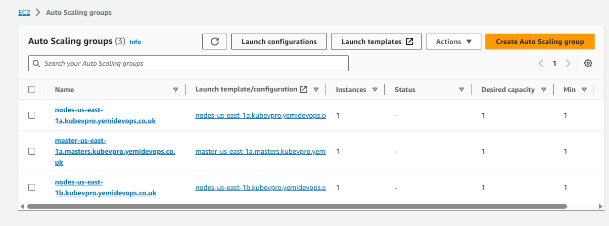
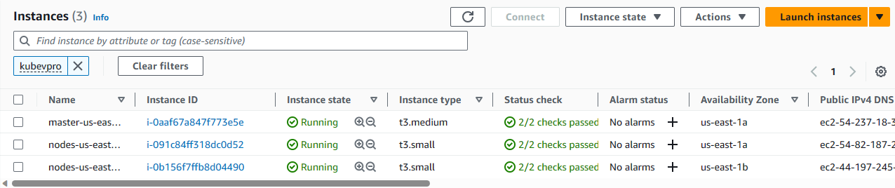
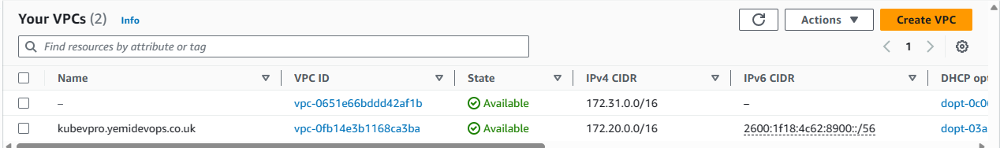


## Step-7: Create Volume for DB Pod

- Create an EBS volume to store MySQL data with the below command
```sh
aws ec2 create-volume --availability-zone us-east-1a --size 3 --volume-type gp2
```


- Next, label the nodes with zone=us-east-1a and zone=us-east-1b accordingly. To be sure that we are running our DB pod in the same zone our EBS volume created, we will create labels for our nodes with the commands below:
```sh
kubectl get nodes
kubectl describe node i-0b156f7ffb8d04490 | grep us-east-1
kubectl label nodes i-0b156f7ffb8d04490  zone=us-east-1b
kubectl get nodes --show-labels
```


## Step-8: Source Code Review

- You can find all Kubernetes manifest files by cloning this repository.
- Clone this repo to your ec2. Make necessary file changes, before applying `kubectl` commands.
```sh
https://github.com/devopshydclub/vprofile-project.git
```
- In Project-12, we containerized the vprofile application and pushed it to DockerHub.
- We will use the images below from DockerHub repository in our k8 manifests.


- Our vprofile application is using the application.properties file below. We need to create Kubernetes services with the same name given in this file for application to connect to them.
```sh
#JDBC Configutation for Database Connection
jdbc.driverClassName=com.mysql.jdbc.Driver
jdbc.url=jdbc:mysql://vprodb:3306/accounts?useUnicode=true&characterEncoding=UTF-8&zeroDateTimeBehavior=convertToNull
jdbc.username=root
jdbc.password=vprodbpass
#Memcached Configuration For Active and StandBy Host
#For Active Host
memcached.active.host=vprocache01
memcached.active.port=11211
#For StandBy Host
memcached.standBy.host=vprocache02
memcached.standBy.port=11211
#RabbitMq Configuration
rabbitmq.address=vpromq01
rabbitmq.port=15672
rabbitmq.username=guest
rabbitmq.password=guest
#Elasticesearch Configuration
elasticsearch.host =vprosearch01
elasticsearch.port =9300
elasticsearch.cluster=vprofile
elasticsearch.node=vprofilenode
```

## Step-9: Kube secret for passwords

- In `application.properties` file, we have db. password and RabbitMQ password. We will encode these values and create a K8s secret file as in given under `Kubernetes` directory.

- Push the `app-secret.yaml` to your Git repository the clone it.
```sh
git clone git clone https://github.com/engrrichie/KUBEAPP.git
ls
cd KUBEAPP/
```


- Now create the secret
```sh
kubectl create -f app-secret.yaml
kubectl get secret
kubectl describe secret
```


## Step-10: DB Deployment & Service Definition

- Add tag in EBS volume that was created earlier else our `db pod` will not be able to attach to volume and will get permission deny error


- Create a K8s DB deployment and service file as given under `kubernetes` directory.

## Step-11: Memcached Deployment & Service Definition

- Create a K8s MC deployment and ClusterIP type service file as in given under `Kubernetes` directory. Execute the commands below to create files
```sh
kubectl apply -f mcdep.yml
kubectl apply -f mc-CIP.yml
```

## Step-12: RabbitMQ Deployment & Service Definition
- Create a K8s RMQ deployment and ClusterIP type service file as in given under Kubernetes directory. Run the commands below to create files
```sh
kubectl apply -f rmq-dep.yml
kubectl apply -f rmq-CIP.yml
```
- We can check the resources created with below command
```sh
kubectl get all
```

## Step-13: Application Deployment & Service Definition

- Create a K8s Application deployment and Load Balancer type service file as in given under Kubernetes directory. Run below commands to create files
```sh
kubectl apply -f vproapp-dep.yml
kubectl apply -f vproapp-svc.yml
```

## Step-14: Create Route53 Record for Application Load Balancer

- Create a record with Alias to Load balancer.
- Validate our application from browser with our new dns name.


- Validated DB by successfully log in with admin_vp/admin_vp username & pwd.
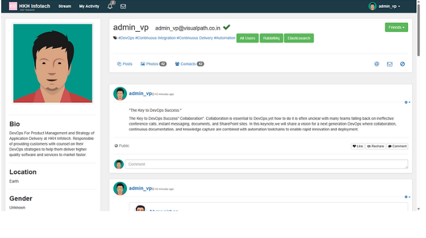

- Now validate RabbitMQ service.
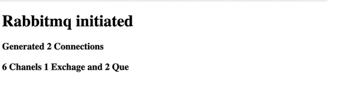

- Lastly, verify the Memcached service.
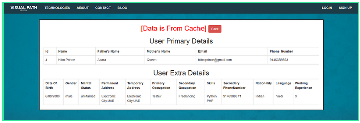

## Step-15: Cleanup

- Start by  deleting  Kubernetes services.
- Then delete cluster, s3 bucket, Route53 Hosted zone.
```sh
kops delete cluster --name kubevpro.<domain name> --state=s3://<Bucket name>
```